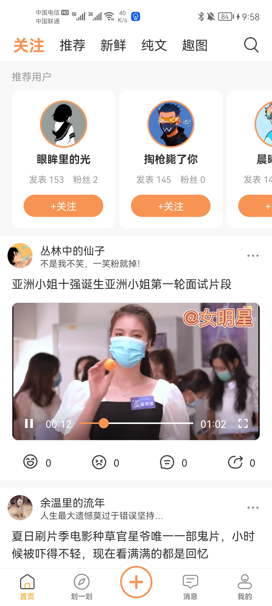
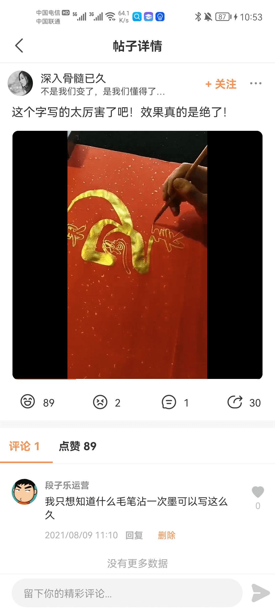

## 一、前言

几年前我开发了一个应用《段子乐》，并在当时也达到了日活7000左右的高峰，不过因为资金的问题（短视频太烧钱），在当时选择了停运项目，直到后面用户都散去之后才重启项目。虽然说项目进行了几次大的改版，现在已经3.0.0了，但是日活却只剩百十来个了。

在朋友的建议下，我决定做一个更有意义的事情，将项目接口和数据进行对外开放，让爱折腾的朋友可以用这些接口做一个自己的应用，当然包括但不仅限于开发一个 Android App，iOS App，小程序，H5应用，Flutter应用等等。

## 二、接口开放简介

《段子乐》本身是一个类似《内涵段子》的应用，主要包含以下功能：

+ 纯文，图片和短视频类型的段子
+ 对段子内容的点赞，评论，收藏和分享
+ 实现类似抖音一样划一划浏览短视频内容
+ 发布纯文，图片和短视频段子
+ 用户关注，粉丝体系
+ 消息系统，对接了极光IM和推送
+ 乐豆系统，积分抽奖等等
+ ...

本次开放除了一些特殊功能包括IM消息相关，第三方QQ微信登录和一键登录之外，其他功能所对应的接口都开放，所以理论上你完全可是实现一个另一个自己的《段子乐》（注：IM和推送你可以自己对接，不让后端介入）。

先大致展示下一些主要的页面：

  
  
  
  
  
  
  
  
  
  
  
  
  
  
  
  
  
  
  
  
  
  
  
  
  
  
  
  
  
  

具体体验一下什么是《段子乐》，请点击：https://www.pgyer.com/rmjK，如果对接完所有接口，你可以大致开发出这么一个APP。

## 三，对接之前

对接接口之前，有些约定要提前告知。开放接口文档已托管到github，后续肯定会有很多新增和修改，将会同步在github上，而不会更新此文章，所以请提前收藏该地址：

### 3.1 获取开放API接口调用凭证

此项目对外开放只针对自己人，所以你需要是RollApi的用户，搜索微信小程序【Roll地盘】，点击我的页面，选择【做个段子应用】，可获取到一个专属的project_token（如果你之前没有绑定过手机号，需要先绑定手机号），获取到这个凭证之后，请妥善保管，并在每次调用任意开放api接口的时候，在请求头中加入一个key-value，key为project_token，value为你刚刚申请的值。

### 3.2 