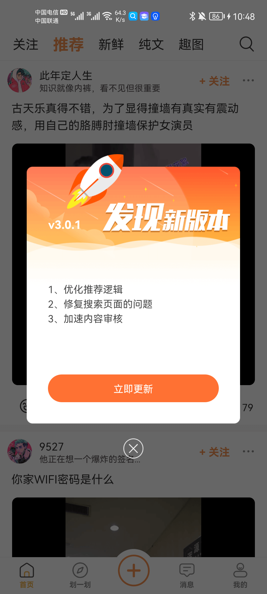

## 一、前言

几年前我开发了一个应用《段子乐》，并在当时也达到了日活7000左右的高峰，不过因为资金的问题（短视频太烧钱），在当时选择了停运项目，直到后面用户都散去之后才重启项目。虽然说项目进行了几次大的改版，现在已经3.0.0了，但是日活却只剩百十来个了。

在朋友的建议下，我决定做一个更有意义的事情，将项目接口和数据进行对外开放，让爱折腾的朋友可以用这些接口做一个自己的应用，当然包括但不仅限于开发一个 Android App，iOS App，小程序，H5应用，Flutter应用等等。

我的个人主页为：https://www.mxnzp.com ，如果你想联系我，在这里可以找到我的联系方式。

## 二、接口开放简介

《段子乐》本身是一个类似《内涵段子》的应用，主要包含以下功能：

+ 纯文，图片和短视频类型的段子
+ 对段子内容的点赞，评论，收藏和分享
+ 实现类似抖音一样划一划浏览短视频内容
+ 发布纯文，图片和短视频段子
+ 用户关注，粉丝体系
+ 消息系统，对接了极光IM和推送
+ 乐豆系统，积分抽奖等等
+ ...

本次开放除了一些特殊功能包括IM消息相关，第三方QQ微信登录和一键登录之外，其他功能所对应的接口都开放，所以理论上你完全可是实现一个另一个自己的《段子乐》（注：IM和推送你可以自己对接，不让后端介入）。

先大致展示下一些主要的页面：

<div align=center style="background: #ccc">
  
  
  
  
  
  
  
  
  
  
  
  
  
  
  
  
  
  
  
  
  
  
  
  
  
  
  
  
  
  

</div>

具体体验一下什么是《段子乐》，请点击：https://www.pgyer.com/rmjK ，如果对接完所有接口，你可以大致开发出这么一个APP。


## 三、对接之前

对接接口之前，有些约定要提前告知。开放接口文档已托管到github，后续肯定会有很多新增和修改，将会同步在github上，而不会更新此文章，所以请提前收藏该地址，你甚至可以点个star：https://github.com/MZCretin/duanzile-open-api

### 3.1 请求接口的HOST地址

请求接口的HOST地址为：http://tools.cretinzp.com/jokes

### 3.2 获取开放API接口调用凭证

此项目对外开放只针对自己人，所以你需要是RollApi的用户，搜索微信小程序【Roll地盘】，点击我的页面，选择【做个段子应用】，可获取到一个专属的project_token（如果你之前没有绑定过手机号，需要先绑定手机号），获取到这个凭证之后，请妥善保管，并在每次调用任意开放api接口的时候，在请求头中加入一个key-value，key为project_token，value为你刚刚申请的值。

### 3.3 调用接口通用的请求头

在你调用的每个接口中，请包含如下请求头信息【必须，后台会强校验】：

| 请求头KEY | 请求头VALUE                                                  | 请求头含义       |
| --------- | ------------------------------------------------------------ | ---------------- |
| token     | 登录成功之后接口会返回token，你需要存储在本地，每次请求带上  | 用户凭证信息     |
| uk        | 设备的唯一id，请尽量保证针对设备唯一，长度32以内             | 用户设备唯一标识 |
| channel   | 请直接填写cretin_open_api                                    | 渠道来源         |
| app       | 拼接版本号版本标识和系统版本，用;分开，例如 1.0.0;1;10，代表版本号1.0.0，版本标识1，系统为Android 10，其他也类似 | app信息          |
| device    | 拼接版本设备信息，设备品牌和设备型号，用;分开，例如HUAWEI;CDY-AN00 | 设备信息         |

### 3.4 接口返回数据的格式

接口返回的数据结构如下，后台能保证只要是请求到了后端，每个接口都会返回这种格式：

+ 其中code代表接口返回的状态码，当code=200，标识此接口请求成功，当code=202代表用户登录状态过期，也就代表你本地的token过期了，此时你需要清除本地的登录状态，让用户重新登录。
+ msg是当code不为200时候的错误信息，你可以将此信息提示给用户。
+ data是该请求的实体数据，具体返回什么格式取决于每个接口本身。

```json
{
  "data": null,
  "msg": "数据返回成功",
  "code": 200
}
```

### 3.5 其他的一些说明

+ **1、如何查看发送成功的验证码**

  接口中有发验证码的接口，当然我没有真的给你的手机号发送一条验证码，否则我短信费也顶不住。当你调用接口发送成功之后，你可以进入【Roll地盘】小程序，然后点击《我的》，然后点击《做个段子应用》，然后点击《查看短信验证码》，就可以查看近期发送的所有验证码信息了；另外一种方式，你可以关注《Cretin的开发之路》公众号，然后输入#13即可查看对应手机号的验证码信息了。

+ **2、项目中发布功能用的图片和视频怎么处理**

  项目中所用到的图片和视频资源均上传到七牛云上面，所以你需要集成七牛云的SDK，上传文件的时候，请调用相关接口获取到七牛云上传token：

  http://tools.cretinzp.com/jokes/doc.html#/3.0.0/%E5%B7%A5%E5%85%B7Helper%E6%8E%A5%E5%8F%A3/getTokenUsingPOST 

  然后再进行上传文件。具体操作可参考链接（这个是Andorid的使用链接，其他端请自行查询）：

  https://developer.qiniu.com/kodo/1236/android

+ **3、接口中返回的视频和图片链接进行了加密，如何解密**

  链接使用了简单的对称加密，请联系我或者加入交流群，我会告知大家加密方式和加密秘钥，解析完即可获取真实的视频链接。

+ **4、...**

## 四、开放接口说明

接口文档已经上传，可直接查看在线接口文档，包含65个API接口。接口地址为：http://tools.cretinzp.com/jokes/doc.html

### 4.1、首页类接口

